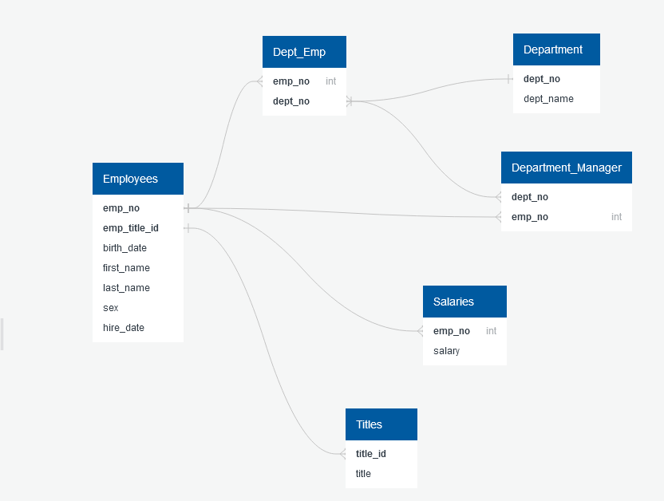
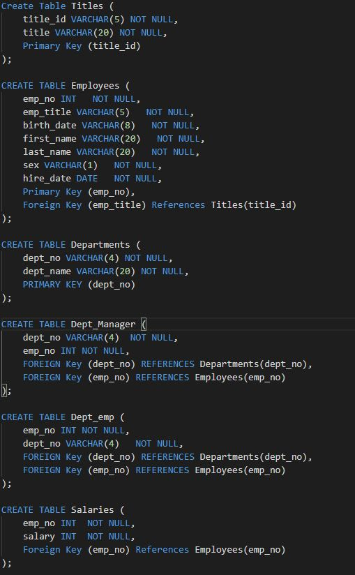
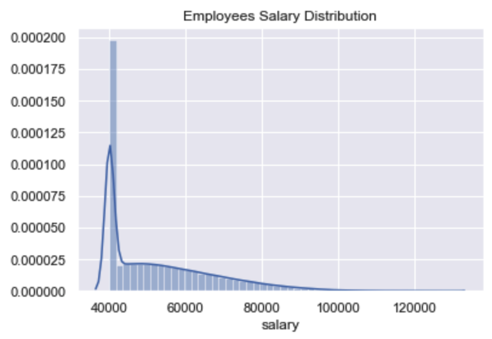
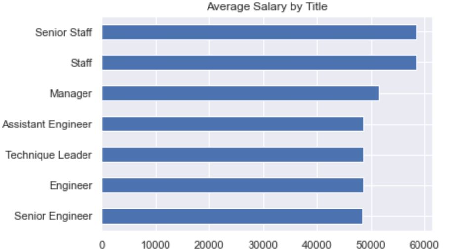

# Employee Database: A Mystery in Two Parts

## Purpose
Import 6 CSV files into a SQL database and research employee files from the 80s and 90s.

## Process
Sketch out an ERD Table to create a table schema for each of the six CSV files, specifying the data types, primary keys, foreign keys and other constraints.

Once a complete database is assembled an analysis of the following information is conducted:
- List of employee number, last name, first name, gender and salary
- List first name, last name, and hire date for employees who were hired in 1986
- List the manager of each department with the following information: department number,          department name, the manager's employee number, last name, first name
- List the department of each employee with the following information: employee number, last name, first name, and department name
- List first name, last name, and sex for employees whose first name is "Hercules" and last names begin with "B."
- List all employees in the Sales department, including their employee number, last name, first name, and department name
- List all employees in the Sales and Development departments, including their employee number, last name, first name, and department name
- In descending order, list the frequency count of employee last names, i.e., how many employees share each last name

## Results and Conclusions (Condensed)

### ERD Table 

### Employee Salary Distribution

### Average Salary by Title

